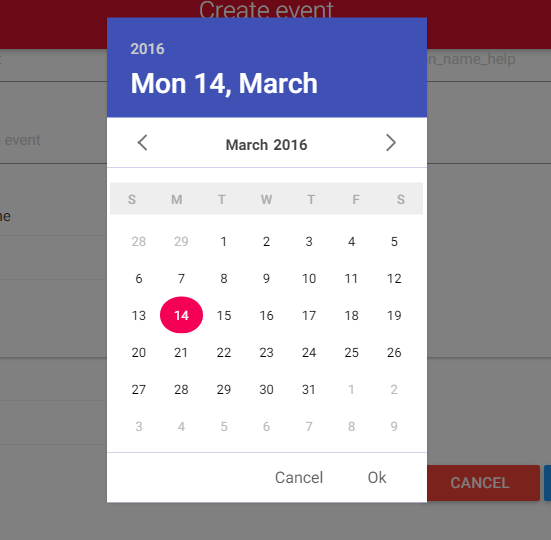

# vue-datepicker
calendar and datepicker component with material design for Vue.js

# Demo

The demo page is [HERE](http://hilongjw.github.io/vue-datepicker/demo.html).



# Requirements

- [Vue.js](https://github.com/yyx990803/vue) `^1.0.0` & `^2.0.0`
- [moment](https://github.com/moment/moment) `^2.11.1`

# Instllation

## npm

```shell
$ npm install vue-datepicker
```

# Usage

```html
<script>
// for Vue 1.0
import myDatepicker from 'vue-datepicker/vue-datepicker-1.vue'

// for Vue 2.0
import myDatepicker from 'vue-datepicker'

export default {
  data () {
    return {
      // for Vue 1.0
      starttime: '',
      endtime: '2016-01-19',
      testTime: '',
      multiTime: '',

      // for Vue 2.0
      startTime: {
        time: ''
      },
      endtime: {
        time: ''
      }

      option: {
        type: 'day',
        week: ['Mo', 'Tu', 'We', 'Th', 'Fr', 'Sa', 'Su'],
        month: ['January', 'February', 'March', 'April', 'May', 'June', 'July', 'August', 'September', 'October', 'November', 'December'],
        format: 'YYYY-MM-DD',
        placeholder: 'when?',
        inputStyle: {
          'display': 'inline-block',
          'padding': '6px',
          'line-height': '22px',
          'font-size': '16px',
          'border': '2px solid #fff',
          'box-shadow': '0 1px 3px 0 rgba(0, 0, 0, 0.2)',
          'border-radius': '2px',
          'color': '#5F5F5F'
        },
        color: {
          header: '#ccc',
          headerText: '#f00'
        },
        buttons: {
          ok: 'Ok',
          cancel: 'Cancel'
        },
        overlayOpacity: 0.5, // 0.5 as default
        dismissible: true // as true as default
      },
      timeoption: {
        type: 'min',
        week: ['Mo', 'Tu', 'We', 'Th', 'Fr', 'Sa', 'Su'],
        month: ['January', 'February', 'March', 'April', 'May', 'June', 'July', 'August', 'September', 'October', 'November', 'December'],
        format: 'YYYY-MM-DD HH:mm'
      },
      multiOption: {
        type: 'multi-day',
        week: ['Mo', 'Tu', 'We', 'Th', 'Fr', 'Sa', 'Su'],
        month: ['January', 'February', 'March', 'April', 'May', 'June', 'July', 'August', 'September', 'October', 'November', 'December'],
        format:"YYYY-MM-DD HH:mm"
      },
      limit: [{
        type: 'weekday',
        available: [1, 2, 3, 4, 5]
      },
      {
        type: 'fromto',
        from: '2016-02-01',
        to: '2016-02-20'
      }]
    }
  },
  components: {
    'date-picker': myDatepicker
  }
}
</script>
<template>
  <div class="card">

    <!-- for Vue 1.0 -->
    <div class="row">
      <span>Departure Date：</span>
      <date-picker :time.sync="starttime" :option="option" :limit="limit"></date-picker>
    </div>

    <!-- for Vue 2.0 -->
    <div class="row">
      <span>Departure Date：</span>
      <date-picker :date="startTime" :option="option" :limit="limit"></date-picker>
    </div>

  </div>
</template>
```

# API

 - Option 

 * type

```
  type: 'day' // 'min', 'multi-day'

```

 * format

```
format: 'YYYY-MM-DD HH:mm'
```

 * placeholder

```
placeholder: 'when?'
```

 * week

```
 week: ['Mo', 'Tu', 'We', 'Th', 'Fr', 'Sa', 'Su']
```

 * month

```
  month: ['January', 'February', 'March', 'April', 'May', 'June', 'July', 'August','September', 'October', 'November', 'December']
```

* inputStyle

```
inputStyle: {
  'display': 'inline-block',
  'padding': '6px',
  'line-height': '22px',
  'font-size': '16px',
  'border': '2px solid #fff',
  'box-shadow': '0 1px 3px 0 rgba(0, 0, 0, 0.2)',
  'border-radius': '2px',
  'color': '#5F5F5F'
}
```

 * color

```
  color: {
    header: '#ccc',
    headerText: '#f00'
  }
```


 * buttons

```
buttons: {
  ok: 'OK',
  cancel: 'Cancel'
}
```

 * animate

```
  overlayOpacity: 0.5, // 0.5 as default
  dismissible: true // as true as default
```


 - limit

  * from sometime to sometime(when from/to is empty, days before/after end/start time will be available)

```javascript

limit: {
  type:'fromto',
  from:'2016-01-10',
  to:'2016-01-30'
}

```
 * weekdays

```javascript

limit:{
  type: 'weekday',
  available: [1, 2, 3, 4, 5] 
}

```

### prop

* Vue 1.0

```javascript

time: '' // string

```

```html

<date-picker :time.sync="time" :limit="limit"></date-picker>

```

* Vue 2.0

```javascript
date: {
  time: '' // string
}
```

```html

<date-picker :date="date" :limit="limit"></date-picker>

```


# License

[The MIT License](http://opensource.org/licenses/MIT)

